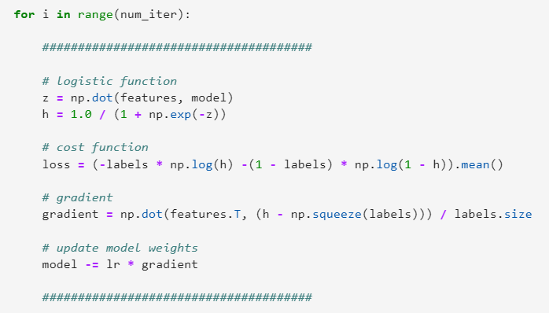
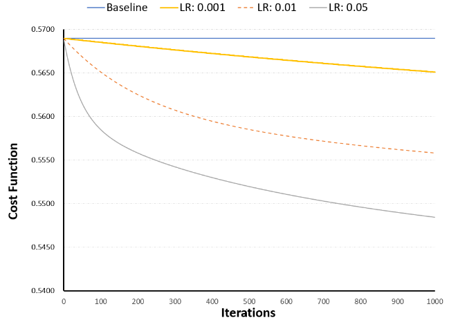

# LogisticRegression Theory and Example
*Individual contribution to group project*

### Goal
The goal of the group project was to use Criteo's digital marketing dataset from Kaggle.com and perform the following:
  1. Formulate Research Question
  2. Algorithm Explanation
  3. EDA & Discussion of Challenges
  4. Alogrithm Implementaton
  5. Application of Course Concepts

### Solution
We had implemented Logistic Regression using Spark on the entire dataset.  This example goes over the theory of Logistic Regression (section 2) and demonstrates the implementation (section 4) in python using a random sample that is 0.0025%  of the original dataset, two numeric variables that were most correlated with the outcome variable and were non-collinear, three categorical variables that had relatively fewer states and fewer missing values.

</img>
  
</img>
